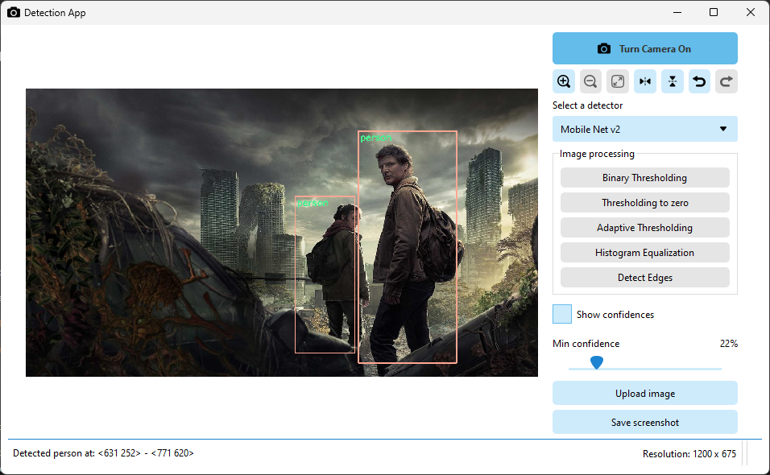
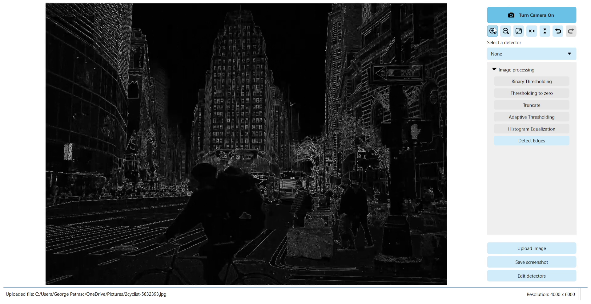
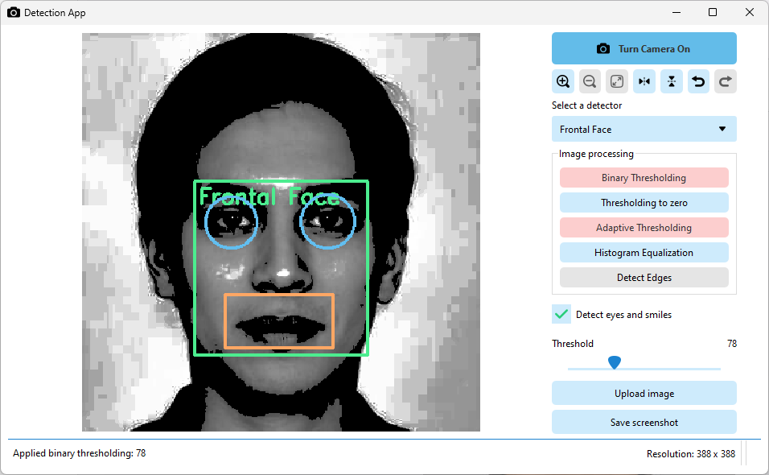
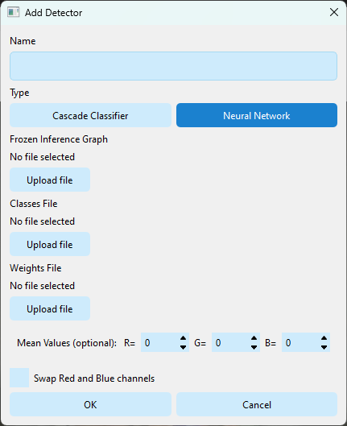

# Detection App

## About

This is a C++ application that mainly detects objects either from your camera or from an uploaded image, using some detection models provided.

## Features

* Choose a detector to use on your image/video
* Save a screenshot of the detected image/video
* Adjust the confidence threshold of the detector (if applicable)
* You can use the following detectors:
    * Face detector (Haar Cascade Classifier or LBP Cascade Classifier)
    * MobileNet SSD (Single Shot MultiBox Detector)
    * custom models (untested, but should work)
* Apply a filter to the image/video before applying the detector
* Available filters:
    * Grayscale
    * Binary Thresholding
    * Thresholding to Zero
    * Adaptive Thresholding (Gaussian)
    * Laplacian Edge Detection

## Requirements

* OpenCV 4.5.0
* CMake 3.16.0
* C++17
* Qt 6.2.4
* Developed and tested on Windows 11 22H2

## Installation

1. Install [OpenCV](https://opencv.org/releases/) (at least version 4.5.0)
2. Install [CMake](https://cmake.org/download/) (at least version 3.16.0)
3. Install [Qt](https://www.qt.io/download) (at least version 6.2.4)
4. Clone this repository
5. Build the project by running the `build.bat` file
6. Run the project generated in the `build` folder (e.g. `build\DetectionApp.sln` for Visual Studio)

## Building a setup package

We don't have an official release yet, but if for some reason you want a setup package, we provided a way to build it yourself:

1. Follow the previous instructions from Installation
2. Right-Click on the project called `PACKAGE` and click **build**
3. After the build is complete, you can fin your installer in `[build_folder]\_CPack_Packages\win64\NSIS`

## Usage

1. Run the application
2. Upload an image or just use your camera
3. Choose a detector
4. Choose one or more filters (optional)
5. Adjust the minimum confidence for whoch detection to show (optional)
6. You can save a screenshot of the detected image/video

If you want to use your own model, you can click the 'Edit Detectors' buton **or** put the files in the `data` folder and add edit
the `detectors.json` file.

You will need to provide a name (this name will be displayed in the dropdown list with detectors), a type for the model, and the paths to the files needed for the model.
The type can be either `cascade` (for Haar/Lbp Cascade Classifiers) or `network` (for Neural Networks, e.g. MobileNet SSD).

If `cascade` is chosen, then `paths` should contain the following:

```json
{
    "name": "model_name",
    "type": "cascade",
    "paths": {
        "face": "path_to_cascade_file_for_face_detection",
        "eyes": "path_to_cascade_file_for_eye_detection",
        "smile": "path_to_cascade_file_for_mouth_detection"
    }
}
```

Only the `face` path is required, the others are optional.

If `network` is chosen, then the object should contain the following:

```json
{
    "name": "model_name",
    "type": "network",
    "properties": {
        "framework": "framework_name",
        "swapRB": false,
        "meanValues": [0, 0, 0]
    },
    "paths": {
        "inf": "path_to_frozen_inference_file",
        "classes": "path_to_classes_file",
        "model": "path_to_model_or_config_file"
    }
}
```

The `properties` object is optional, and can contain the following:
* `framework` - the framework used to train the model (e.g. `caffe`, `tensorflow`, `torch`, `darknet`, `onnx`)
* `swapRB` - whether to swap the red and blue channels (default is `false`)
* `meanValues` - the mean values for the model (default is `[0, 0, 0]`)

The `paths` object contains the paths to the files needed for the model:
* `inf` - the frozen inference graph file
* `classes` - the classes file
* `model` - the model or config file

## Screenshots

MobileNet SSD simple object detection



MobileNet SSD with Binary Thresholding and GrayScale filters



Face detector with Thresholding to Zero and GrayScale filters



Interface for adding a new detector


