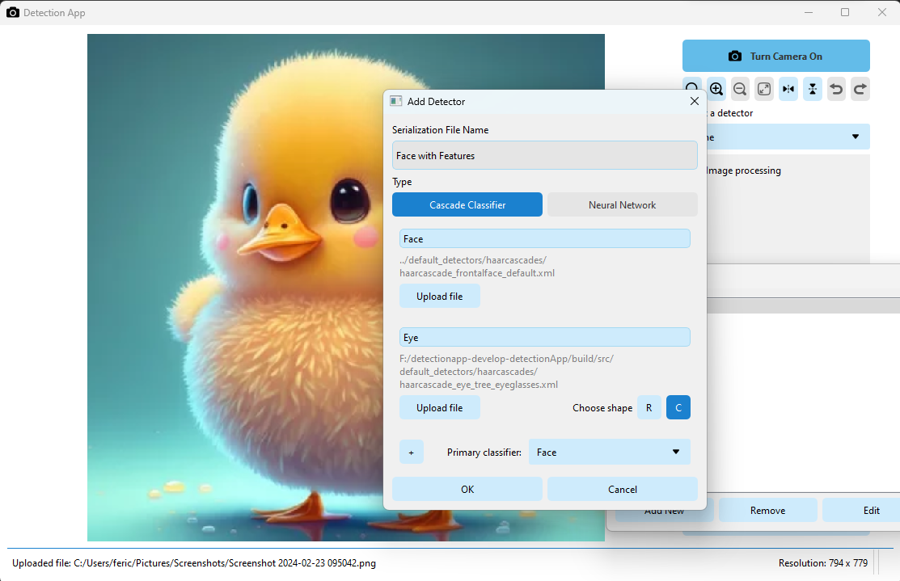

# Detection App

## About

A C++ application that detects objects either from your camera or from an uploaded image, using some detection models provided.

## Features

* Choose a detector to use on your image/video
* Save a screenshot of the detected image/video
* Adjust the confidence threshold of the detector (if applicable)
* The following detectors are included by default:
  * **Frontal Face** (Haarcascade)
  * **Face with Features** (a group of cascades, detecting faces and eyes on those faces)
  * **MobileNet SSD v2** (Single Shot MultiBox Detector)
  * **Traffic Detector** (custom-made, detects `persons` and `vehicles`)
* Apply and adjust some filters to the image/video before applying the detector:
  * Binary Thresholding
  * Thresholding to Zero
  * Truncate Thresholding
  * Adaptive Thresholding (Gaussian)
  * Triangle Thresholding
  * Grayscale Histogram Equalization
  * Color Histogram Equalization
  * Sobel
  * Binomial
  * Canny
  * Opening

## Build Requirements

* OpenCV 4.5.0
* CMake 3.16.0
* C++17
* Qt 6.2.4
* Developed and tested on Windows 11 22H2

## Installation

1. Install [OpenCV](https://opencv.org/releases/) (at least version 4.5.0)
2. Install [CMake](https://cmake.org/download/) (at least version 3.16.0)
3. Install [Qt](https://www.qt.io/download) (at least version 6.2.4)
4. Clone this repository
5. Build the project by running the `build.bat` file
6. Run the project generated in the `build` folder (e.g. `build\DetectionApp.sln` for Visual Studio)

## Building a setup package

We don't have an official release yet, but if for some reason you want a setup package, we provided a way to build it yourself:

1. Follow the previous instructions from Installation
2. Right-Click on the project called `PACKAGE` and click **build**
3. After the build is complete, you can find your installer in `[build_folder]\_CPack_Packages\win64\NSIS`

## Usage

1. Run the application
2. Upload an image or just use your camera
3. Choose a detector
4. Choose one or more filters (optional)
5. Adjust the minimum confidence for whoch detection to show (optional)
6. You can save a screenshot of the detected image/video

If you want to use your own model, you can click the 'Edit Detectors' button **or** create a new `.yaml` file int the `/data/detector_paths` folder. The name of the file will be showed in the dropdown list.

The are 3 possible detector types:

1. `CASCADE` - a haarcascade/lbpcascade, a simple image classifer that detects a single object type, annotated by the `objectLabel` property

    ```yaml
    %YAML:1.0
    ---
    type: CASCADE
    objectLabel: "Object Name"
    cascadeFilePath: "path/to/cascade.xml"
    ```

    > `obectLabel` represents the label shown in the bounding box drawn on the image after detection

2. `CASCADE_GROUP` - a group made up of multiple cascades, each with their own `objectLabel` that can be disabled individually

    ```yaml
    %YAML:1.0
    ---
    type: CASCADE_GROUP
    classifiers:
    -
        objectLabel: Face
        enabled: 1
        shape: 0
        cascadeFilePath: "path/to/face/cascade.xml"
    -
        objectLabel: Eye
        enabled: 1
        shape: 1
        cascadeFilePath: "path/to/eye/cascade.xml"
    primary: Face
    ```

    > `shape` can be `1` for rectangle or `0` for circle
    >
    > Cascade Groups contain a primary cascade and 1 or more secondary cascades. The secondary cascades will only perform inside the primary cascade's bounding box (if any).

3. `NETWORK` - a Neural Network containing a model file, a config (weights) file and a text file containing the labels

    ```yaml
    %YAML:1.0
    ---
    type: NETWORK
    modelFilePath: "path/to/model.pbtxt.txt"
    configFilePath: "path/to/frozen_inference_graph.pb"
    labelsFilePath: "path/to/classes.txt"
    ```

    > Some models do not require a config (frozen interference) file, so this property is optional. However you do need to include it if the model needs it, otherwise the app will show an error.
    >
    > We tested using `TensorFlow`'s `protobuff` files (with the `.pbtxt` extension) and `ONNX` models
    >
    > `labelsFilePath` should be a `.txt` file where each line represents an object's name. If missing, the app will show them as `Object 1`, `Object 2`, etc.  

## Screenshots

> MobileNet SSD simple object detection

---
> Edge Detection (Canny) filter

---
> Face detector (Cascade Group) with Thresholding to Zero and GrayScale filters
>
> **Note:** UI is slightly outdated

---
> UI for adding a new Detector

